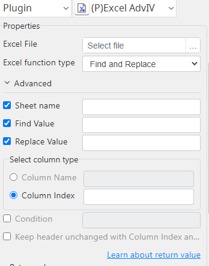
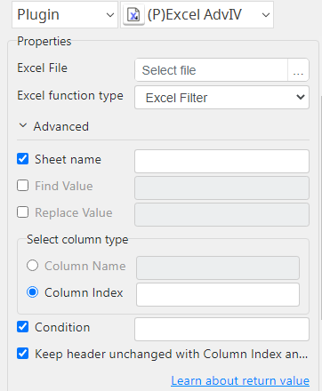

# Excel Advance IV

***Excel Advance IV with this plug-in filter and find-replace operation performed on the xlsx file.***

## Excel Advance IV
| Item           |             Value              |
|----------------|:------------------------------:|
| Icon           |   |
| Display Name   |      **Excel Advance IV**      |

### Arun Kumar (arunk@argos-labs.com)

Arun Kumar
* [Email](mailto:arunk@argos-labs.com) 
 
## Version Control 
* [5.904.1319](setup.yaml)
* Release Date: `September 4, 2023`

## Input (Required)
| OP Type           | Parameters                 | Output            |
|-------------------|----------------------------|-------------------|
| Excel Filter      | Excel File                 | output_file_path  |
|                   | Sheet name                 |                   |
|                   | Column Name / Column Index |                   |
|                   | Condition                  |                   |
| Find and Replace  | Excel File                 | output_file_path  |
|                   | Sheet name                 |                   |
|                   | Find Value                 |                   |
|                   | Replace Value              |                   |

## Return Value

### Normal Case
Description of the output result

## Return Code
| Code | Meaning                          |
|------|----------------------------------|
| 0    | Success                          |
| 98   | ArgumentParser (argparse) Error  |
| 99   | General Exception                |

## Output Format
You may choose one of 3 output formats below,

<ul>
  <li>String (default)</li>
  <li>CSV</li>
  <li>File</li>
</ul>  

## Parameter setting examples (diagrams)

## Operations

### Excel Filter:

### Find and Replace:

